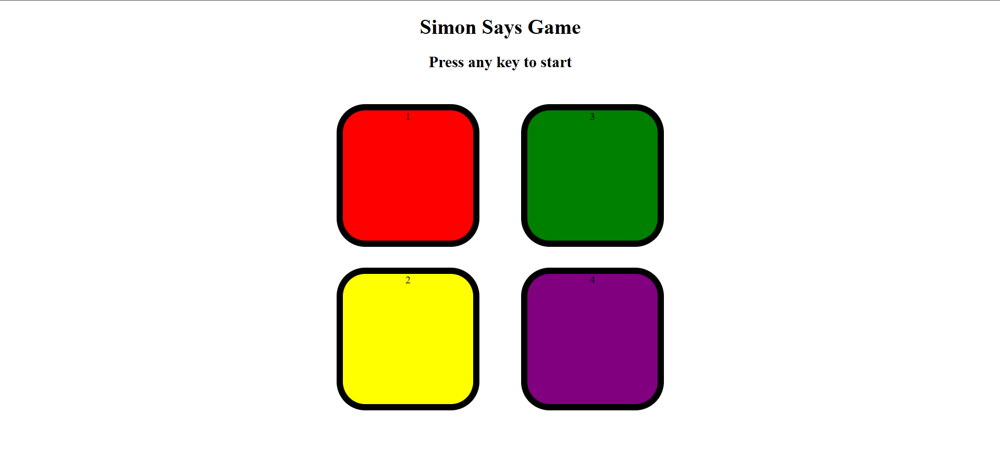

# 🟢 Simon Says Game

A fun and colorful memory game built using **HTML, CSS, and JavaScript**!  
Test your memory skills by repeating the sequence of colors as they light up.

## 🧠 How It Works

- The game shows you a random sequence of button flashes.
- You have to repeat the exact same sequence by clicking the buttons.
- Each round adds one more color to the sequence.
- One mistake and it's game over!

---

## 🛠️ Built With

- 🧱 **HTML5** – Game structure
- 🎨 **CSS3** – Styling and animations
- ⚙️ **JavaScript** – Game logic and interactions

---

## 📸 Preview

---

## 🚀 Features

- Dynamic color sequences
- Sound effects on button press
- Game over detection
- Score tracking (optional if you added it)
- Responsive design (if it works well on mobile too)

---

